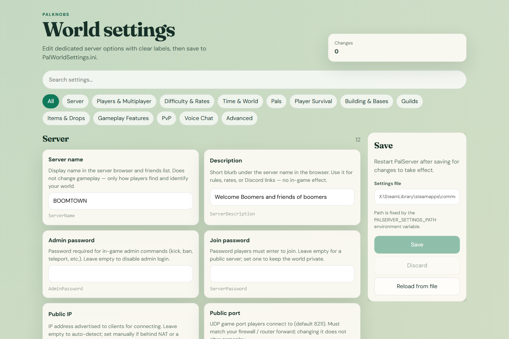

# PalKnobs

Edit your Palworld dedicated server's world settings in a friendly desktop app — no hand-editing `PalWorldSettings.ini`.

> **Disclaimer:** PalKnobs is an unofficial, fan-made tool and is not
> affiliated with, endorsed by, or sponsored by Pocketpair, Inc. Palworld is a
> trademark of Pocketpair, Inc.



## Download & install

1. Go to the [**Releases**](https://github.com/jasonrundell/palknobs/releases/latest) page and download the latest **`PalKnobs Setup X.Y.Z.exe`**.
2. Run the installer and choose where to install it.
3. **Windows may warn on first run.** Because this app isn't code-signed yet, Windows SmartScreen may show *"Windows protected your PC."* This is expected for a new open-source app. To continue, click **More info**, then **Run anyway**.

**You need:**

- Windows
- A local PalServer install with an existing `PalWorldSettings.ini`

No Node.js or build tools required — the installer is self-contained.

## Using PalKnobs

1. Launch PalKnobs.
2. Confirm or change the **Settings file** path in the sidebar — click **Browse…** to pick your `PalWorldSettings.ini`. The choice is saved for next time.
3. Search or filter settings by category; edit values with toggles, sliders, and inputs.
4. **Save** to write changes back to `PalWorldSettings.ini`, or **Reload from file** to pick up edits made elsewhere.
5. Restart your PalServer so the game reloads the settings.

## Where your settings file lives

By default PalKnobs looks under your PalServer install:

`C:\Program Files (x86)\Steam\steamapps\common\PalServer\Pal\Saved\Config\WindowsServer\PalWorldSettings.ini`

If yours is elsewhere, use the **Settings file** field (or **Browse…**) in the sidebar and click **Apply path**. If the file can't be loaded on startup, the error screen has the same picker.

---

## Developing (from source)

Prefer to run from source or contribute? You'll need **Node.js 20+**.

```bash
npm install
```

### Web (browser)

Starts the API on port `8787` and the UI on port `5173`:

```bash
npm run dev
```

Then open [http://localhost:5173](http://localhost:5173).

### Desktop (Electron)

```bash
npm run electron:dev      # dev with hot reload
npm run electron:start    # production build, no installer
npm run electron:build    # build the Windows .exe installer into release/
```

The installer is written to `release/PalKnobs Setup *.exe`. Use `npm run electron:build:dir` to produce an unpacked app in `release/win-unpacked/` without installing.

### API only

```bash
npm run start
```

### Tests

```bash
npm test
```

## Advanced: overriding the settings path (Windows)

Set an environment variable before launching to override where PalKnobs looks:

```powershell
# PowerShell — override the PalServer install root (e.g. a non-default library)
$env:PALSERVER_ROOT = "D:\Games\PalServer"

# ...or pin the exact INI path (the app UI can't change this while it's set)
$env:PALSERVER_SETTINGS_PATH = "D:\Games\PalServer\Pal\Saved\Config\WindowsServer\PalWorldSettings.ini"
```

See [`.env.example`](.env.example) for all supported variables.

When not overridden, PalKnobs remembers your chosen path in:

| Context | Location |
| --- | --- |
| Web / CLI | `%USERPROFILE%\.palknobs\config.json` |
| Desktop (Electron) | `%APPDATA%\PalKnobs\config.json` |

## License

[MIT](LICENSE) © 2026 Jason Rundell
